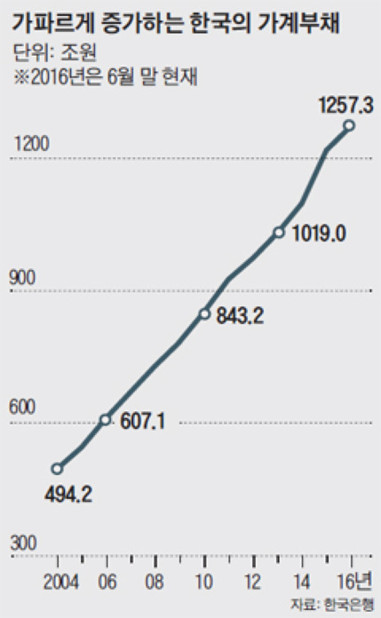

## 1. 가계부채의 개념 ##

**가계부채**(=가계신용)는 사람들이 신용이나 부동산을 담보로 대출받은 빚을 말한다.

### 가계부채의 종류  ###
1. 가계 대출 
    + 미래에 소비할 것을 목적으로 대출 받는 것
    + 각종 금융기관에서 빌린 주택구입용 대출, 일반 대출금
2. 판매 신용
    + 현재 소비한 것에 대해 대출 받는 것
    + 신용카드나 할부를 이용해서  생기는 대출금

### 가계부채의 수준 ###
    2016년: 1300조

### 가계부채의 구성비 ###
    가계대출 : 판매신용 = 95 : 5

### 금융권의 분류 ###
1. 제도 금융권
    + 제1금융권
        + 일반은행: 시중은행, 지방은행, 외국계은행
        + 특수은행: 산업은행, 수출입은행, 기업은행, 농협, 수협
    + 제2금융권
        + 증권사, 보험사, 캐피탈, 저축은행
2. 비제도 금융권
    + 제3금융권
        + 소비자금융: 사채, 대부업체

## 2. 가계부채 1300조는 심각한 것인가? ##
문제해결 측면에서 '**심각하다**'는 것은 어떤 사태를 쉽게 해결할 수 없게 되었고 더 큰 위험이 닥칠 수도 있음을 뜻한다. 가계부채 1300조가 심각한 수준이 맞는지 알아보자.

한 개인의 입장에서 생각해보자. 어떤 목적이 되었든 빚이 생기면 갚아야 하고, 갚기 위해서는 개인의 소득과 자산이 필요하다. 빚이 멈추어 있지 않고 증가한다면, 개인이 갖고 있는 소득이 늘어나야 하거나 자산이 많이 남아 있어야 한다. 그러므로 가계부채 1300조라는 절대적인 금액보다는 가계부채의 증가세와 가계소득의 증가세를 함께 살펴볼 필요가 있다.

  

위 그래프에서 2014년 이후  최근 연도를 보면 빨간 선의 기울기가 파란 선의 기울기보다 크다. 즉 가계소득보다 가계부채가 더 빠르게 증가하고 있다. 

## ----not yet----- ##

## 2. 가계부채는 언제부터 증가했는가? ##
    
    

    2006년부터 최근 10년 동안 지속적으로 증가

## @@@3. 가계부채는 언제 발생하는가? ##

## 4. 가계부채가 증가하는 원인은 무엇인가? ##
1. 저금리
    + 저금리 → 은행 예금으로 얻는 이자 수익 감소 → 사람들은 은행을 제외한 다른 투자처 물색 → 상업용 부동산(투기용 건물과 아파트)에 자금이 쏠림 → 부동산 구매를 위한 주택담보대출 증가 → 가계부채 증가`
2. 가계의 가처분 소득 감소
    + 저성장 경기침체 → 가계의 소득 증가율 감소 → 가처분 소득 증가율 감소 → 물가 상승 등으로 인한 소비에 필요한 금액 증가 → 생활자금에 대한 가계대출 증가
3. 정부의 부동산 부양책
    + 저성장 경기침체 → 부동산 시장 활성화를 위한 부동산 대출규제 완화 → LTV(담보인정비율) 및 DTI(총부채상환비율) 상승 → 가계대출 증가

> + LTV(Loan To Value ratio)  
> 우리 집 아파트를 담보로 해서 대출받을 수 있는 최대 금액 (비율)  
> ex) LTV 50%일 때, 5억 원 아파트 → 최대 2억 5천만 원 대출 가능  

> + DTI(Debt to Income ratio)  
> 연봉을 담보로 해서 대출받을 수 있는 최대 금액 (비율)  
> ex) DTI 50%일 때, 연봉 3천만 원 → @@@최대 연간 원리금 상환액 1,500만 원 대출 가능

> + 투자 vs 투기  
> 공통점: 이익 추구  
> 차이점: 생산활동 포함 유무  
> ex) 상품을 생산하는 공장 건설 목적으로 부동산 구매 → 투자  
> ex) 가격의 인상을 노리고 일정 기간 후에 이익을 남기고 되팔려는 목적으로 부동산 구매 → 투기

## 5. 가계부채가 소비에 미치는 영향은 무엇인가? ##

## 6. 가계부채 증가로 인한 소비 트렌드 예측 ##

## 6. 정부는 가계부채의 증가에 어떻게 대응해야 하는가? ##

## 7. 소득계층별로 차지하는 가계부채의 구성은 어떻게 되는가? ##

## 8. 추가조사 ##

## 참고문헌 ##
+ LG경제연구원, 2016, "미래 부실위험 높이는 가계부채, 현재 소비에는 플러스 요인"

## 임시 ##
\

  

\

\